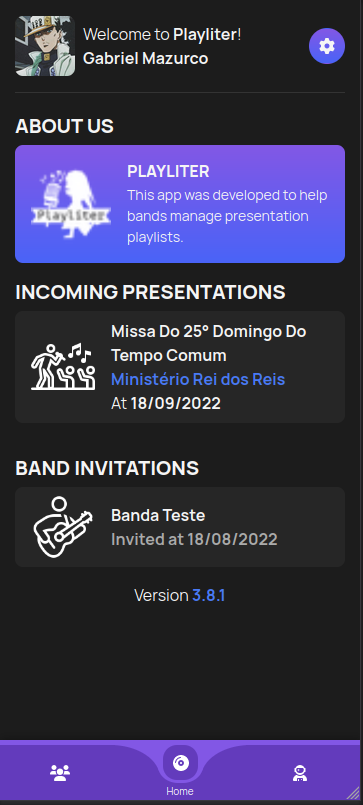

# Playliter PWA

A band management app developed by [@Mazurco066](https://github.com/Mazurco066).
Production publish URL: [Playliter](https://playliter.vercel.app/).

## Screenshots

| List screen                          | Pokémon details                         |
| ------------------------------------ | --------------------------------------- |
|       |          |

## Libraries and Structure

This app was developed using

* **[Vuejs](https://vuejs.org/)** - Web development Framework
* **[Bootstrap 4](https://getbootstrap.com/)** - Visual Framework based on Material Design
* **[SweetAlert2](https://sweetalert2.github.io/)** - Popup library
* **[Font Awesome](https://fontawesome.com/)** - App Icons
* **[Apollo](https://www.apollographql.com/)** - Http client for GraphQL APIs

## Setup

Assuming you have [yarn](https://yarnpkg.com/), run the following commands to install dependencies and run the App:

```sh
yarn install
yarn serve
```

Obs: Dont forget to copy the content of .env.example file to a new .env file before starting

### License

This project is licensed under the MIT License. Check the [LICENSE](LICENSE) file for further details.